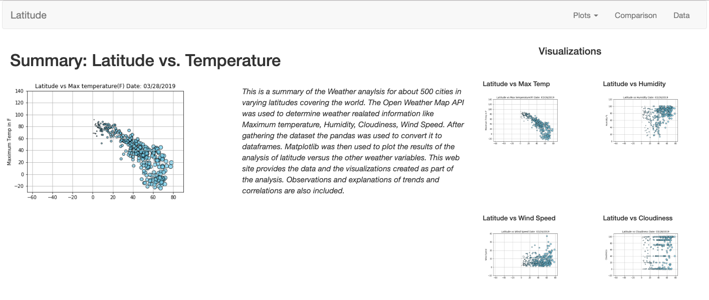
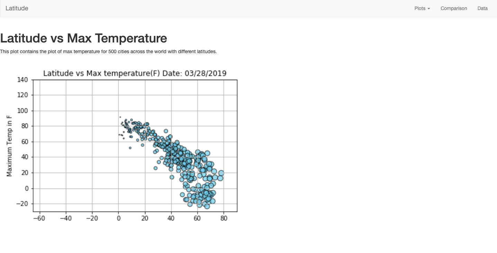
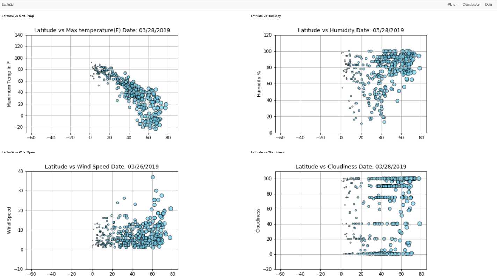
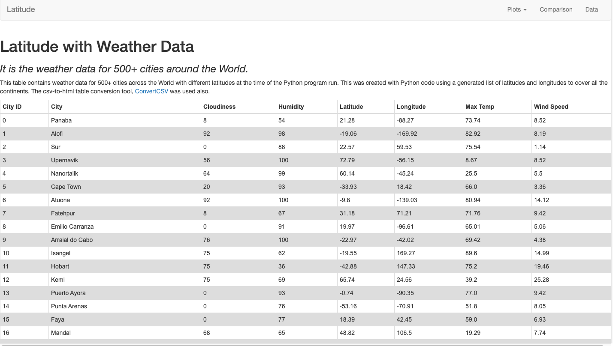

## Web Visualization Dashboard (Latitude)

- Run the WeatherPy.ipynb to get the world wide city weather data (max temp, humidity, wind speed, cloudness)
- Visualize the data using pandas dataframe (data table) and matplotlib (scatter plots)

### Weather Summary

### Max Temperature

### Weather Comparison

### Weather Data Table

